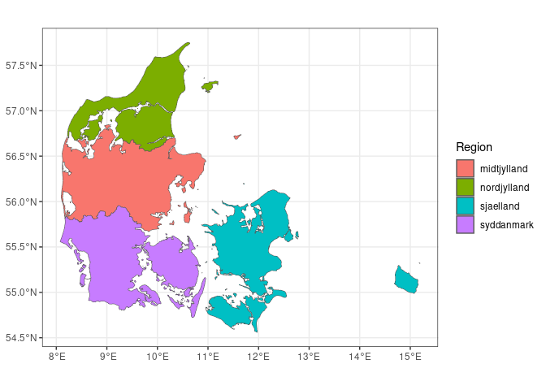

<!-- README.md is generated from README.Rmd. Please edit that file -->

# NonOverlappingProblem

<!-- badges: start -->
<!-- badges: end -->

The goal of NonOverlappingProblem is to generate non-overlapping
problems for the group of mathematicians

## Load necessary packages:

first we load the needed packages:

``` r
library(geodata)
library(TroublemakeR)
library(terra)
library(ggplot2)
library(tidyterra)
```

The goal of DanishLandusePerRegion is to generate and solve the problems
for transforming 14% of agriculture to nature, and which nature type,
though to the problem not being able to be solved for the whole country
so far.

``` r
DK <- geodata::gadm(country = "dk", path = getwd())

DK$NAME_1 <- ifelse(DK$NAME_1 == "Hovedstaden", "Sjælland", DK$NAME_1)

Regions <- terra::aggregate(DK, by = "NAME_1") 
Regions$NAME_1 <- janitor::make_clean_names(Regions$NAME_1)
```

Here is the division of Denmark in the regions used for the analyses

``` r
ggplot() + geom_spatvector(data = Regions, aes(fill = NAME_1)) + theme_bw() + scale_fill_discrete(name = "Region")
```

<!-- -->

We now generate a data frame with the values that we will use for the
scaling:

``` r
DF <- data.frame(RegionNames = Regions$NAME_1, area = NA, total_cells = NA, budget = NA)
DF$area <- terra::expanse(Regions)
DF$total_cells <- DF$area |> 
  magrittr::divide_by(200*200) |> 
  round()

DF$budget <- DF$area |> 
  magrittr::divide_by(200*200) |>
  magrittr::multiply_by(0.14) |> 
  floor()

DF$area <- DF$area/1000000
```

We can see here the table with the Region, the total area in square
kilometers, the total number of cells in the area, and the budget in
number of cells to change from agriculture to nature.

## Generate .dat file for AMPL

now we generate the .dat file for every ampl problem:

for this we first read the agriculture layer, and the potential landuse
layers

and then we loop through all the process in the readme but for all the
shapefiles generated above:

``` r
# Create directories to store region-specific problem files and templates
dir.create("RegionProblems")
dir.create("RegionTemplates")

# Initialize a vector to track used cells across iterations
UsedCells <- as.numeric()

# Loop through each region in the Regions object
for(i in 1:nrow(Regions)){
  
   # Load and process the land-use and agricultural layers
  LandUse <- terra::rast("HabSut/HabSut.tif")
  
  Agriculture <- terra::rast("agr.tif") |> 
    terra::project(terra::crs(LandUse)) |> 
    resample(LandUse, method = "near") |> 
    round()
  
  # Extract the specific region and reproject it
  Area <- Regions[i,]
  Area <- terra::project(Area, terra::crs(LandUse))
  
  # Mask the land-use and agricultural layers to the current region
  LandUse <- LandUse |> 
    terra::mask(Area)
  
  Agriculture <- Agriculture |> 
    terra::mask(Area)
  
  # Process the nature layer and classify cells
  Nature <- terra::rast("existing_nature_types.tif") |>
    terra::project(terra::crs(LandUse)) |> 
    resample(LandUse, method = "near") |> 
    terra::mask(Area)
  NumNature <- as.numeric(Nature)
  NumNature <- terra::ifel(is.na(Nature) & !is.na(Agriculture), 0, NumNature)
  
  # Map nature types to shorter labels for simplicity
  DF <- data.frame(value = 0:8, nature_type = c("Agriculture", levels(Nature)[[1]]$nature_type)) 
  
  DF$nature_type <- stringr::str_replace_all(DF$nature_type, "Forest", "F")
  DF$nature_type <- stringr::str_replace_all(DF$nature_type, "Open", "O")
  DF$nature_type <- stringr::str_replace_all(DF$nature_type, "Dry", "D")
  DF$nature_type <- stringr::str_replace_all(DF$nature_type, "Wet", "W")
  DF$nature_type <- stringr::str_replace_all(DF$nature_type, "Poor", "P_N")
  DF$nature_type <- stringr::str_replace_all(DF$nature_type, "Rich", "R_N")
  DF$nature_type <- stringr::str_replace_all(DF$nature_type, "Agriculture", "Ag")
  levels(NumNature) <- DF
  
    # Load and process phylogenetic diversity layers
  PD <- list.files(path = "Results/PD/", pattern = "^PD_.*\\.tif$", full.names = T) |> rast()
  AddAgriculture <- PD[[1]] 
  AddAgriculture <- terra::ifel(!is.na(AddAgriculture), 0 , NA)
  PDNames <- list.files(path = "Results/PD/", pattern = "^PD_.*\\.tif$", full.names = F) |> 
    stringr::str_remove_all(".tif") |> 
    stringr::str_remove_all("PD_")
  names(PD) <- PDNames
  names(AddAgriculture) <- "Agriculture"
  PD <- c(AddAgriculture, PD)
  names(PD) <- stringr::str_replace_all(names(PD), "Forest", "F")
  names(PD) <- stringr::str_replace_all(names(PD), "Open", "O")
  names(PD) <- stringr::str_replace_all(names(PD), "Dry", "D")
  names(PD) <- stringr::str_replace_all(names(PD), "Wet", "W")
  names(PD) <- stringr::str_replace_all(names(PD), "Poor", "P_N")
  names(PD) <- stringr::str_replace_all(names(PD), "Rich", "R_N")
  names(PD) <- stringr::str_replace_all(names(PD), "Agriculture", "Ag")
  
  PD <- PD |> 
    terra::mask(Area)
  
  PD <- terra::ifel(is.na(NumNature), NA, PD)
  PD <- terra::ifel(!is.na(NumNature) & is.na(PD), 0, PD)
  
  NormPD <- round((PD/max(minmax(PD))), 2)
  NormPD <- terra::mask(NormPD, NumNature)
  
  # Load and process species richness layers
  Richness <- list.files(path = "Results/Richness/", pattern = "^Richness_.*\\.tif$", full.names = T) |> rast()

RichnessNames <- list.files(path = "Results/Richness/", pattern = "^Richness_.*\\.tif$", full.names = F) |> 
  stringr::str_remove_all(".tif") |> 
  stringr::str_remove_all("Richness_")

names(Richness) <- RichnessNames

Richness <- Richness |> 
  terra::mask(Area)

Richness <- c(PD[[1]], Richness)

Richness <- terra::ifel(is.na(Richness), NA, Richness)
Richness <- terra::ifel(!is.na(Richness) & is.na(Richness), 0, Richness)
NormRichness <- round((Richness/max(minmax(Richness))), 2)
NormRichness <- terra::mask(NormPD, NumNature)

names(NormRichness) <- stringr::str_replace_all(names(NormRichness), "Forest", "F")
names(NormRichness) <- stringr::str_replace_all(names(NormRichness), "Open", "O")
names(NormRichness) <- stringr::str_replace_all(names(NormRichness), "Dry", "D")
names(NormRichness) <- stringr::str_replace_all(names(NormRichness), "Wet", "W")
names(NormRichness) <- stringr::str_replace_all(names(NormRichness), "Poor", "P_N")
names(NormRichness) <- stringr::str_replace_all(names(NormRichness), "Rich", "R_N")
names(NormRichness) <- stringr::str_replace_all(names(NormRichness), "Agriculture", "Ag")

  # Load and process rarity layers

  Rarity <- list.files(path = "Results/Rarity/", pattern = "^Rarity_.*\\.tif$", full.names = T) |> rast()

RarityNames <- list.files(path = "Results/Rarity/", pattern = "^Rarity_.*\\.tif$", full.names = F) |> 
  stringr::str_remove_all(".tif") |> 
  stringr::str_remove_all("Rarity_")

names(Rarity) <- RarityNames

Rarity <- Rarity |> 
 # terra::crop(Area) |> 
  terra::mask(Area)

Rarity <- c(PD[[1]], Rarity)

Rarity <- terra::ifel(is.na(Rarity), NA, Rarity)
Rarity <- terra::ifel(!is.na(Rarity) & is.na(Rarity), 0, Rarity)
NormRarity <- round((Rarity/max(minmax(Rarity))), 2)
NormRarity <- terra::mask(NormPD, NumNature)

names(NormRarity) <- stringr::str_replace_all(names(NormRarity), "Forest", "F")
names(NormRarity) <- stringr::str_replace_all(names(NormRarity), "Open", "O")
names(NormRarity) <- stringr::str_replace_all(names(NormRarity), "Dry", "D")
names(NormRarity) <- stringr::str_replace_all(names(NormRarity), "Wet", "W")
names(NormRarity) <- stringr::str_replace_all(names(NormRarity), "Poor", "P_N")
names(NormRarity) <- stringr::str_replace_all(names(NormRarity), "Rich", "R_N")
names(NormRarity) <- stringr::str_replace_all(names(NormRarity), "Agriculture", "Ag")

Template <- NumNature
Template <- ifel(is.na(NumNature), NA, 1)
values(Template)[UsedCells] <- NA

values(NumNature)[UsedCells] <- NA
levels(NumNature) <- DF
TroublemakeR::define_cells(Rasterdomain = NumNature,
                           name = paste0("RegionProblems/", Regions$NAME_1[i]))

TroublemakeR::landuse_names(landuses = levels(NumNature)[[1]]$nature_type, name = paste0("RegionProblems/", Regions$NAME_1[i]))

TroublemakeR::write_ampl_lines("set ForestLanduses := FDP_N FDR_N FWP_N FWR_N", name = paste0("RegionProblems/", Regions$NAME_1[i]))

TroublemakeR::write_ampl_lines("set WetLanduses := FWP_N FWR_N OWP_N OWR_N", name = paste0("RegionProblems/", Regions$NAME_1[i]))

TroublemakeR::find_connections(Rasterdomain = NumNature, 
                               name = paste0("RegionProblems/", Regions$NAME_1[i]))

DummyStack <- SpatioTemporalCont::generate_dummy_stack(NumNature)

TroublemakeR::species_suitability(Rastercurrent = DummyStack, species_names = names(DummyStack), parameter = "Existingnature", name = paste0("RegionProblems/", Regions$NAME_1[i]))

values(NormPD)[UsedCells] <- NA
TroublemakeR::species_suitability(Rastercurrent = NormPD, species_names = names(NormPD), parameter = "PhyloDiversity", name = paste0("RegionProblems/", Regions$NAME_1[i]))

values(NormRichness)[UsedCells] <- NA
TroublemakeR::species_suitability(Rastercurrent = NormRichness, species_names = names(NormRichness), parameter = "Richness", name = paste0("RegionProblems/", Regions$NAME_1[i]))

values(NormRarity)[UsedCells] <- NA
TroublemakeR::species_suitability(Rastercurrent = NormRarity, species_names = names(NormRarity), parameter = "Rarity", name = paste0("RegionProblems/", Regions$NAME_1[i]))

selected_cells <- terra::expanse(Area, unit = "m") |> 
  sum() |> 
  magrittr::divide_by(res(Agriculture)[1]*res(Agriculture)[2]) |> 
  magrittr::multiply_by(0.14) |> 
  ceiling()

TroublemakeR::write_ampl_lines(paste("param b :=", selected_cells), name = paste0("RegionProblems/", Regions$NAME_1[i]))

Forest_cells <- round(selected_cells*0.422668)

Wet_cells <- round(selected_cells*0.169067)

Each_Land_Cells <- floor(selected_cells*0.05)

TroublemakeR::write_ampl_lines(paste("param MinFor :=", Forest_cells), name = paste0("RegionProblems/", Regions$NAME_1[i]))

TroublemakeR::write_ampl_lines(paste("param MinWet :=", Wet_cells), name = paste0("RegionProblems/", Regions$NAME_1[i]))

TroublemakeR::write_ampl_lines(paste("param MinLan :=", Each_Land_Cells), name = paste0("RegionProblems/", Regions$NAME_1[i]))

TroublemakeR::write_ampl_lines("param TransitionCost default 1", name = paste0("RegionProblems/", Regions$NAME_1[i]))

TroublemakeR::write_ampl_lines("param SpatialContiguityBonus := 0.01", name = paste0("RegionProblems/", Regions$NAME_1[i]))

Agriculture <- DummyStack[[1]]
Agriculture <- ifel(Agriculture == 1, 1, NA)

TroublemakeR::write_cell_param(Rasterparam = Agriculture, parameter = "CanChange", name = paste0("RegionProblems/", Regions$NAME_1[i]), default = 0)

SpatioTemporalCont::write_cog(Template, paste0(Regions$NAME_1[i], ".tif"))

Cells <- terra::as.data.frame(NumNature[[1]], cells = T) |> dplyr::pull(cell)
UsedCells <- append(UsedCells, Cells)
}

saveRDS(UsedCells, "UsedCells.rds")
```
